# PRAKTIKUM KOMDAT & JARKOM MODUL 2 — THE MESH 2026

## Anggota Kelompok

| Nama                          | NRP        |
| ------------------------------ | ---------- |
| Iqbal Rizki Muhammad Fadhli    | 5027251027 |
| Tafidah Hasna Mumtazah               | 5027251025      |

> Domain yang digunakan: **iqbal.com**

## Laporan

1. Sebagai pusat kesadaran *The Mesh*, **rootkit** harus merentangkan koneksinya ke lima gerbang utama (Switch). Tetapkan alamat IP dan *default gateway* untuk seluruh Entitas, mulai dari para operator (alpha, beta, gamma), penjaga *directory* (prab, tedd), gerbang penyaring (abbey, penny), hingga *repository* (obladi, desmond, oblada, molly) sesuai dengan topologi pembagian switch yang dirancang.

---


Pada tahap awal ini, kami membangun fondasi topologi jaringan *The Mesh*. **rootkit** bertindak sebagai *router* sentral yang merentangkan lima jalur (subnet) berbeda melalui lima *interface*-nya, masing-masing menuju satu *switch*.

#### **Konfigurasi**

| Node          | IP Address       | Gateway        |
| -------------- | ----------------- | --------------- |
| rootkit eth1   | `192.235.1.1/24`  | -                |
| rootkit eth2   | `192.235.2.1/24`  | -                |
| rootkit eth3   | `192.235.3.1/24`  | -                |
| rootkit eth4   | `192.235.4.1/24`  | -                |
| rootkit eth5   | `192.235.5.1/24`  | -                |
| alpha          | `192.235.4.2/24`  | `192.235.4.1`    |
| beta           | `192.235.4.3/24`  | `192.235.4.1`    |
| gamma          | `192.235.4.4/24`  | `192.235.4.1`    |
| delta          | `192.235.5.2/24`  | `192.235.5.1`    |
| epsilon        | `192.235.5.3/24`  | `192.235.5.1`    |
| prab           | `192.235.1.2/24`  | `192.235.1.1`    |
| tedd           | `192.235.1.3/24`  | `192.235.1.1`    |
| abbey          | `192.235.2.2/24`  | `192.235.2.1`    |
| penny          | `192.235.3.2/24`  | `192.235.3.1`    |
| obladi         | `192.235.1.4/24`  | `192.235.1.1`    |
| desmond        | `192.235.1.5/24`  | `192.235.1.1`    |
| oblada         | `192.235.1.6/24`  | `192.235.1.1`    |
| molly          | `192.235.1.7/24`  | `192.235.1.1`    |

**Konfigurasi Router (rootkit):**

```bash
sysctl -w net.ipv4.ip_forward=1
ip addr add 192.235.1.1/24 dev eth1
ip addr add 192.235.2.1/24 dev eth2
ip addr add 192.235.3.1/24 dev eth3
ip addr add 192.235.4.1/24 dev eth4
ip addr add 192.235.5.1/24 dev eth5
```

-----

#### **Validasi**

```bash
ip addr
ip route
ping -c 3 192.235.1.1
ping -c 3 192.235.2.1
ping -c 3 192.235.3.1
```

**Hasil:**
Setiap node menggunakan alamat IP sesuai subnet dan `rootkit` sebagai default gateway.


---

2. Meskipun *The Mesh* beroperasi dalam bayang-bayang, Rootkit menyadari bahwa Entitas di dalamnya masih membutuhkan asupan paket dari dunia luar. Buka jalur menuju NAT dengan memastikan antarmuka WAN di router rootkit aktif. Konfigurasikan NAT agar dapat meneruskan lalu lintas keluar bagi seluruh alamat internal, sehingga semua host di dalam jaringan dapat menjangkau internet publik menggunakan IP address.

Pada tahap ini, kami membuka akses internet untuk seluruh *host* internal. Tugas ini diselesaikan dengan mengonfigurasi **rootkit** untuk melakukan **NAT (Network Address Translation)**, sehingga alamat IP privat dari setiap *host* diterjemahkan menjadi alamat IP WAN rootkit saat mengakses internet.

#### **Konfigurasi di rootkit**

Langkah pertama memastikan *IP forwarding* diaktifkan, kemudian menambahkan satu aturan `iptables` untuk melakukan `MASQUERADE` pada semua paket yang keluar lewat *interface* `eth0` (WAN) dan berasal dari jaringan internal `192.235.0.0/16`.

```sh
echo 1 > /proc/sys/net/ipv4/ip_forward

apt update
apt install iptables -y
iptables -t nat -A POSTROUTING -o eth0 -s 192.235.0.0/16 -j MASQUERADE
```

-----

#### **Validasi**

```sh
cat /proc/sys/net/ipv4/ip_forward
iptables -t nat -L POSTROUTING -n -v
ping -c 3 8.8.8.8
```

**Hasil yang Diharapkan:**

* `cat /proc/sys/net/ipv4/ip_forward` bernilai `1`.
* `iptables -t nat -L POSTROUTING -n -v` menampilkan rule `MASQUERADE`.
* `alpha` menerima balasan dari `8.8.8.8`, membuktikan permintaan dari IP privat `192.235.4.2` berhasil diterjemahkan oleh rootkit menjadi IP publiknya dan diteruskan ke internet.

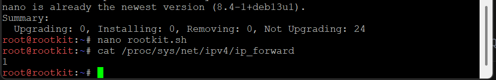
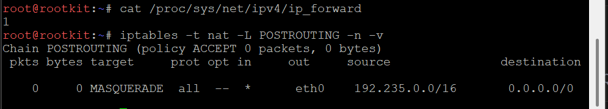
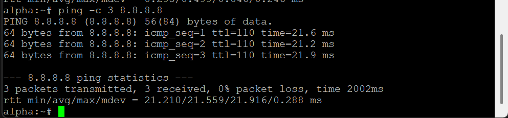

---

3. Jaringan rahasia tidak akan berfungsi tanpa sinkronisasi antar divisi. Pastikan seluruh Entitas dapat saling terhubung dan berkomunikasi lintas jalur (routing internal via rootkit berfungsi). Untuk menghindari fragmentasi saat persiapan, pastikan setiap host non-router menambahkan resolver 192.168.122.1 saat antarmukanya aktif agar akses untuk mengunduh paket instalasi dari internet tersedia sejak awal beroperasi.

Pada tahap ini kami memastikan dua hal fundamental: pertama, seluruh klien di jalur yang berbeda dapat saling berkomunikasi melalui *router* rootkit; kedua, seluruh *host* non-router dikonfigurasi dengan *resolver* DNS sementara agar dapat mengakses internet untuk kebutuhan instalasi paket di awal.

#### **Konfigurasi**

1. **Routing Internal** sudah aktif secara implisit sejak soal 2, karena `ip_forward` sudah diaktifkan di rootkit.
2. **Resolver DNS Awal** ditambahkan pada setiap *host* non-router melalui *Edit config*, dieksekusi otomatis saat *interface* aktif:

```
auto eth0
iface eth0 inet static
  address 192.235.4.2
  netmask 255.255.255.0
  gateway 192.235.4.1
  up echo "nameserver 192.168.122.1" > /etc/resolv.conf
```

-----

#### **Validasi**

```sh
ping -c 3 192.235.1.2   # prab (Switch1)
ping -c 3 192.235.2.2   # abbey (Switch4)
ping -c 3 192.235.3.2   # penny (Switch5)
ping -c 3 192.235.5.2   # delta (Switch7)
cat /etc/resolv.conf
```

**Hasil yang Diharapkan:**
Seluruh *ping* lintas subnet berhasil (`0% packet loss`), membuktikan *routing* internal via rootkit berfungsi dua arah. `/etc/resolv.conf` pada setiap *host* non-router menunjukkan baris `nameserver 192.168.122.1`.

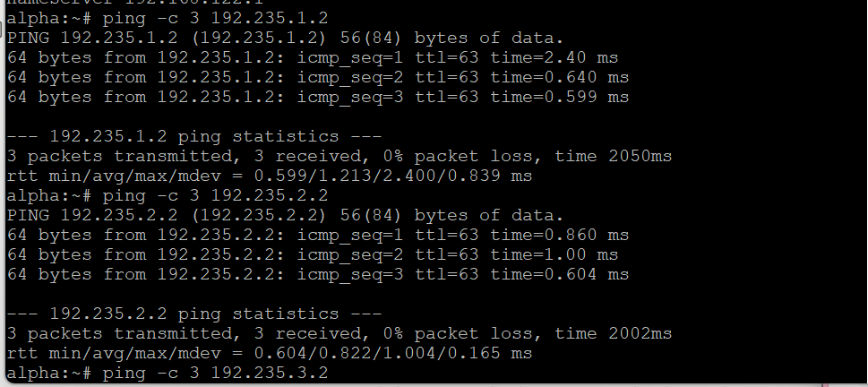
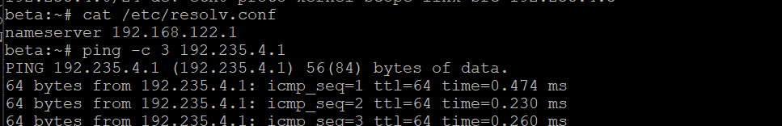

---

4. Penjaga Direktori mulai menuliskan hukum *The Mesh*. Pada node prab, bangun zona `iqbal.com` sebagai *authoritative* dengan SOA yang menunjuk ke prab, serta tambahkan catatan NS untuk prab dan tedd. Buat A record untuk prab dan tedd yang mengarah ke alamat IP mereka masing-masing, serta A record *apex* yang mengarah ke gerbang aplikasi dinamis (penny). Aktifkan fitur *notify* dan *allow-transfer* ke tedd, lalu set *forwarders* ke 192.168.122.1. Di node tedd, tarik zona dari master dan pastikan server menjawab secara *authoritative*.

Pada tahap ini dibangun layanan DNS menggunakan konsep **master-slave** untuk domain `iqbal.com`. Node **prab** berperan sebagai DNS *master* / *authoritative*, sedangkan **tedd** berperan sebagai DNS *slave* yang menyalin zona dari prab melalui *zone transfer*.

| Node | Peran                          |
| ---- | ------------------------------- |
| prab | DNS Master / Authoritative DNS |
| tedd | DNS Slave                       |

#### **Konfigurasi di prab (Master)**

Paket yang digunakan: `bind`, `bind-tools` (image Alpine).

`/etc/bind/named.conf.options`:

```
options {
    directory "/var/bind";
    pid-file "/var/run/named/named.pid";
    forwarders { 192.168.122.1; };
    dnssec-validation no;
    listen-on { any; };
    allow-query { any; };
    allow-recursion { any; };
    recursion yes;
};
```

`/etc/bind/named.conf.local`:

```
zone "iqbal.com" {
    type master;
    file "/etc/bind/db.iqbal.com";
    notify yes;
    allow-transfer { 192.235.1.3; };
};
```

`/etc/bind/db.iqbal.com` (zona awal):

```
$TTL    604800
@       IN      SOA     prab.iqbal.com. admin.iqbal.com. (
                              1         ; Serial
                         604800         ; Refresh
                          86400         ; Retry
                        2419200         ; Expire
                         604800 )       ; Negative Cache TTL
;
@       IN      NS      prab.iqbal.com.
@       IN      NS      tedd.iqbal.com.

@       IN      A       192.235.3.2
prab    IN      A       192.235.1.2
tedd    IN      A       192.235.1.3
```

#### **Konfigurasi di tedd (Slave)**

`/etc/bind/named.conf.local`:

```
zone "iqbal.com" {
    type slave;
    file "/var/bind/db.iqbal.com";
    masters { 192.235.1.2; };
};
```

-----

#### **Validasi**

```sh
dig @127.0.0.1 iqbal.com
dig @127.0.0.1 iqbal.com SOA +short
ls -la /var/bind/db.iqbal.com
```

**Hasil yang Diharapkan:**
*Output* `dig` dari prab menampilkan `flags: qr aa rd ra` (flag `aa` menandakan jawaban *authoritative*). Di tedd, file `db.iqbal.com` muncul di `/var/bind/` dan nilai serial SOA sama dengan master.

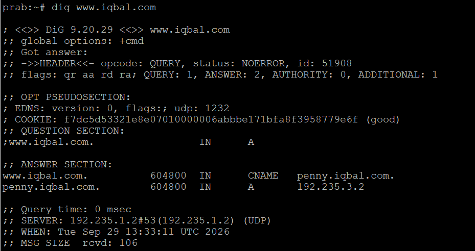
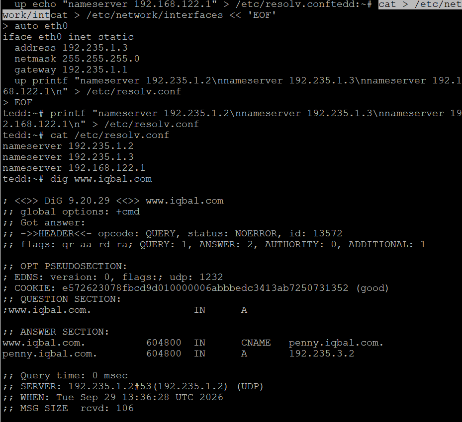
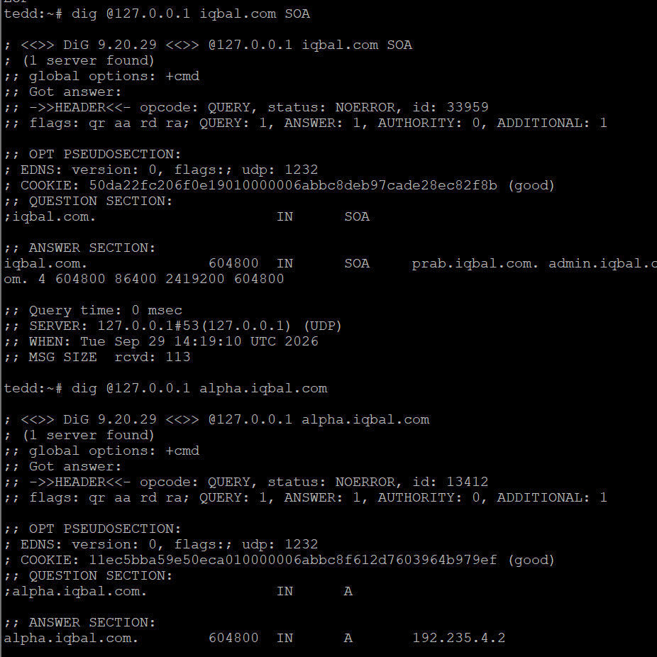

---

5. "Entitas tanpa identitas adalah anomali," pesan Rootkit. Namai semua Entitas (*hostname*) sesuai glosarium, dan verifikasi bahwa setiap host mengenali *hostname* tersebut secara *system-wide*. Buat setiap domain untuk masing-masing node sesuai dengan namanya dan *assign* IP masing-masing juga.

Pada tahap ini setiap *node* diberikan *hostname* sesuai identitasnya, serta didaftarkan sebagai A record di zona `iqbal.com` sehingga setiap *entitas* memiliki domain sendiri.

#### **Konfigurasi**

```sh
echo prab > /etc/hostname
hostname prab
```

Hostname yang digunakan: `rootkit, alpha, beta, gamma, delta, epsilon, prab, tedd, abbey, penny, obladi, desmond, oblada, molly`.

A record ditambahkan ke `/etc/bind/db.iqbal.com` di prab:

```
abbey   IN A 192.235.2.2
penny   IN A 192.235.3.2
obladi  IN A 192.235.1.4
desmond IN A 192.235.1.5
oblada  IN A 192.235.1.6
molly   IN A 192.235.1.7
```

-----

#### **Validasi**

```sh
hostname
dig @192.235.1.2 abbey.iqbal.com
dig @192.235.1.2 penny.iqbal.com
```

**Hasil yang Diharapkan:**
Perintah `hostname` pada setiap node menampilkan nama sesuai glosarium. Query domain masing-masing node mengembalikan A record yang sesuai dengan IP-nya.


---

6. Pastikan zone transfer berjalan, pastikan tedd telah menerima salinan zona terbaru dari prab. Nilai serial SOA di keduanya harus sama karena keduanya tidak bisa dipisahkan dan saling melengkapi.

Pada tahap ini dipastikan mekanisme *zone transfer* antara prab (master) dan tedd (slave) berjalan konsisten setiap ada perubahan zona.

#### **Konfigurasi**

Tidak ada konfigurasi tambahan — mekanisme ini sudah aktif sejak soal 4 melalui kombinasi `notify yes` di prab dan `masters { 192.235.1.2; }` di tedd. Setiap perubahan pada file zona di prab diikuti dengan menaikkan nomor *serial* SOA dan me-restart `named`.

-----

#### **Validasi**

```sh
dig @192.235.1.2 iqbal.com SOA +short
dig @192.235.1.3 iqbal.com SOA +short
```

**Hasil yang Diharapkan:**
Kedua perintah mengembalikan nomor *serial* yang identik, membuktikan tedd telah menerima salinan zona terbaru dari prab.

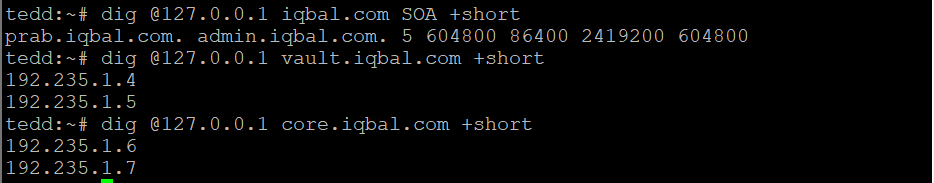
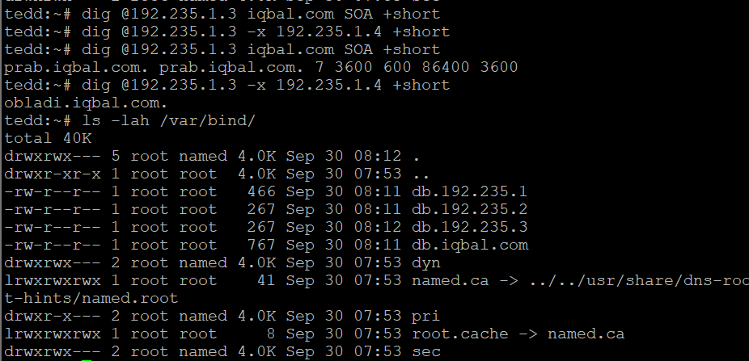

---

7. abbey dan penny sebagai gerbang utama, obladi dan desmond sebagai web statis, oblada dan molly sebagai web dinamis. Tambahkan pada zona A record untuk vault (IP obladi & desmond), dan core (IP oblada & molly). Tetapkan CNAME: www → penny, static → abbey.

Pada tahap ini ditambahkan *grouping record* untuk area **vault** (web statis) dan **core** (web dinamis), serta CNAME kanonik untuk kedua gerbang.

#### **Konfigurasi di prab (Master)**

```
vault   IN A 192.235.1.4
vault   IN A 192.235.1.5

core    IN A 192.235.1.6
core    IN A 192.235.1.7

www     IN CNAME penny.iqbal.com.
static  IN CNAME abbey.iqbal.com.
```

-----

#### **Validasi**

```sh
dig @192.235.1.2 www.iqbal.com
dig @192.235.1.2 static.iqbal.com
dig @192.235.1.2 vault.iqbal.com
dig @192.235.1.2 core.iqbal.com
```

**Hasil yang Diharapkan:**
`www.iqbal.com` mengarah ke `penny.iqbal.com` (`192.235.3.2`). `static.iqbal.com` mengarah ke `abbey.iqbal.com` (`192.235.2.2`). `vault.iqbal.com` dan `core.iqbal.com` masing-masing mengembalikan dua A record sesuai anggotanya.

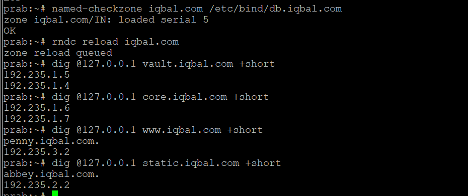
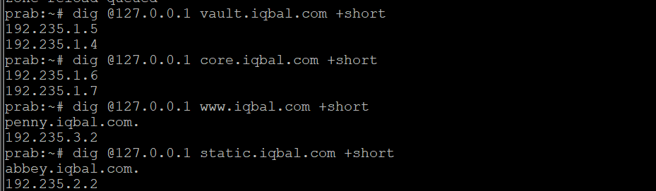

---

8. Di prab (ns1) deklarasikan *reverse zone* untuk segmen jaringan tempat abbey, penny, area vault, dan area core berada. Di tedd (ns2) tarik reverse zone tersebut sebagai *slave*, isi PTR untuk keempat hostname itu agar pencarian balik IP address mengembalikan hostname yang benar.

Pada tahap ini diimplementasikan **reverse DNS** mencakup jaringan `192.235.1.0/24`, `192.235.2.0/24`, dan `192.235.3.0/24`.

#### **Konfigurasi di prab (Master Reverse Zone)**

```
192.235.1.4 → obladi.iqbal.com
192.235.1.5 → desmond.iqbal.com
192.235.1.6 → oblada.iqbal.com
192.235.1.7 → molly.iqbal.com
192.235.2.2 → abbey.iqbal.com
192.235.3.2 → penny.iqbal.com
```

#### **Konfigurasi di tedd (Slave Reverse Zone)**

Reverse zone ditarik sebagai *slave* dengan master menunjuk ke prab (`192.235.1.2`).

-----

#### **Validasi**

```sh
dig @192.235.1.2 -x 192.235.1.4
dig @192.235.1.3 -x 192.235.1.4
```

**Hasil yang Diharapkan:**
Kedua server (master maupun slave) menjawab secara *authoritative*, mengembalikan `obladi.iqbal.com` sebagai hasil pencarian balik untuk `192.235.1.4`.

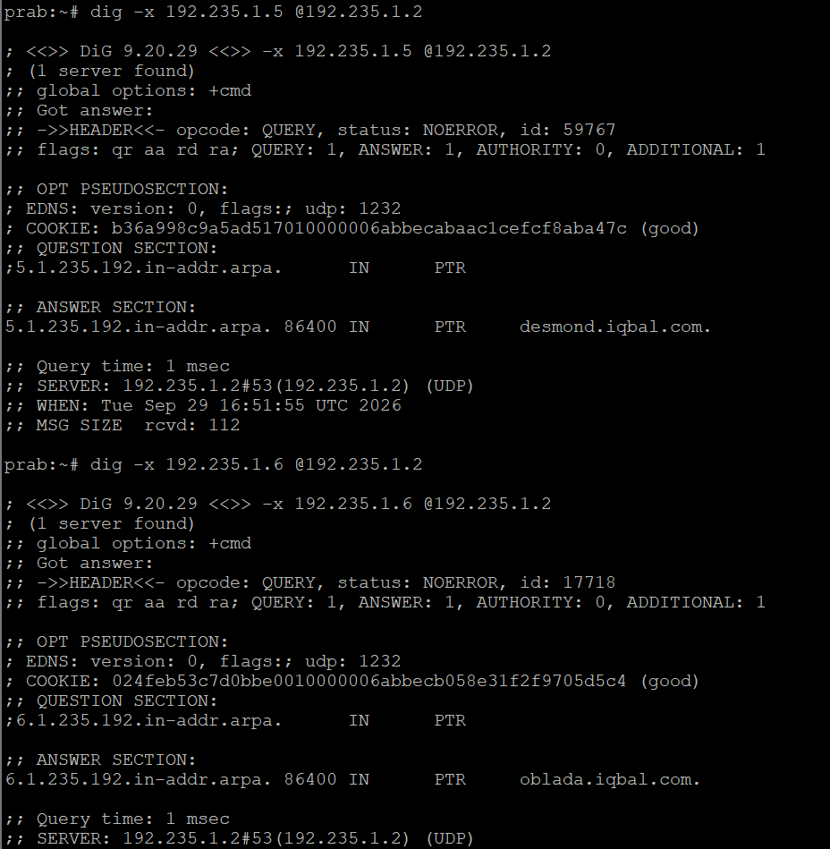

---

9. Jalankan layanan web statis pada hostname di node area vault (menggunakan apache). Buka folder direktori /arsip/ dan aktifkan fitur autoindex (directory listing) sehingga seluruh daftar file di dalamnya dapat ditelusuri langsung dari browser. Akses pengujian harus dilakukan melalui hostname, bukan IP address.

Pada tahap ini dijalankan layanan web statis di area **vault**, yaitu **obladi** dan **desmond**, menggunakan Apache dengan fitur *directory listing* diaktifkan pada folder `/arsip/`, diakses melalui hostname `vault.iqbal.com`.

#### **Konfigurasi**

Backend:
- `obladi` — `192.235.1.4`
- `desmond` — `192.235.1.5`

```apache
<Directory "/var/www/vault/arsip">
    Options +Indexes
    AllowOverride None
    Require all granted
</Directory>
```

-----

#### **Validasi**

```bash
httpd -t
ss -lntp | grep ':80'
curl -I -H "Host: vault.iqbal.com" http://192.235.1.4/
curl -I -H "Host: vault.iqbal.com" http://192.235.1.5/
curl -H "Host: vault.iqbal.com" http://192.235.1.4/arsip/
```

**Hasil:**
Apache berjalan pada backend vault dan `/arsip/` dikonfigurasi untuk directory listing melalui `vault.iqbal.com`.

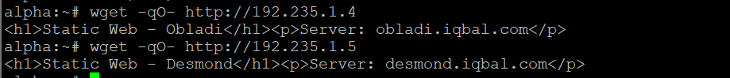
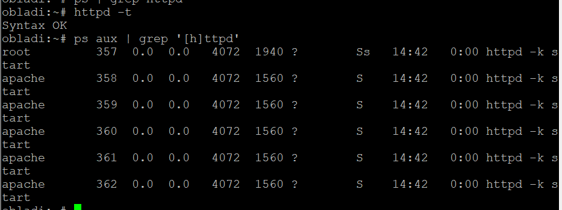
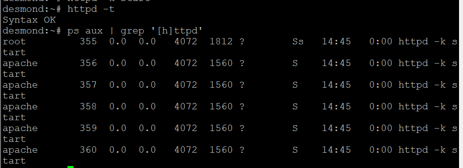

---

10. Jalankan layanan web dinamis (PHP-FPM) pada hostname di node core (menggunakan nginx). Buat sebuah aplikasi sederhana yang memuat halaman beranda dan halaman profil. Terapkan aturan rewrite pada server sehingga akses ke /profil dapat berfungsi dengan URL bersih (tanpa akhiran .php). Akses pengujian wajib dilakukan melalui hostname.

Pada tahap ini dijalankan layanan web dinamis di area **core**, yaitu **oblada** dan **molly**, menggunakan Nginx + PHP-FPM, lengkap dengan *URL rewrite* agar `/profil` dapat diakses tanpa akhiran `.php`, melalui hostname `core.iqbal.com`.

#### **Konfigurasi**

Backend:
- `oblada` — `192.235.1.6`
- `molly` — `192.235.1.7`

```nginx
server {
    listen 80;
    server_name core.iqbal.com;

    root /var/www/core;
    index index.php;

    location / {
        try_files $uri $uri/ $uri.php?$query_string;
    }

    location /profil {
        try_files $uri $uri.php =404;
    }

    location ~ \.php$ {
        include fastcgi_params;
        fastcgi_param SCRIPT_FILENAME $document_root$fastcgi_script_name;
        fastcgi_pass 127.0.0.1:9000;
    }
}
```

-----

#### **Validasi**

```bash
nginx -t
ss -lntp | grep ':80'
ps | grep '[p]hp-fpm'
curl -I -H "Host: core.iqbal.com" http://127.0.0.1/
curl -H "Host: core.iqbal.com" http://127.0.0.1/profil
```

**Hasil:**
Nginx dan PHP-FPM berhasil berjalan pada `oblada` dan `molly`. Pengujian menghasilkan `HTTP/1.1 200 OK` dan `X-Powered-By: PHP/8.4.21`.

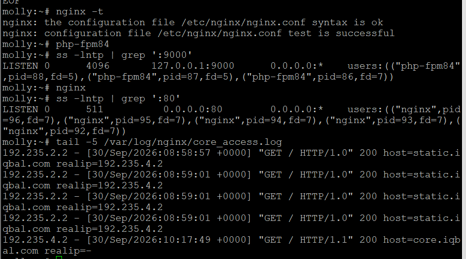

---

11. Konfigurasikan Penny (menggunakan Apache) sebagai reverse proxy yang mengarah ke semua node di area vault. Konfigurasikan Abbey (menggunakan Nginx) sebagai reverse proxy menuju area core. Pastikan kedua gerbang ini meneruskan identitas asli pengunjung ke server backend dengan melakukan forwarding header Host dan X-Real-IP.

Pada tahap ini **penny** dan **abbey** dikonfigurasi sebagai *reverse proxy* sekaligus *load balancer* menuju backend masing-masing.

```text
                    ┌───────────────┐
                    │    ROOTKIT    │
                    │    Router     │
                    └───────┬───────┘
                            │
          ┌─────────────────┼─────────────────┐
          │                 │                 │
       PRAB/TEDD          PENNY             ABBEY
       DNS Server       Reverse Proxy      Reverse Proxy
                            │                 │
                      ┌─────┴─────┐     ┌────┴─────┐
                      │           │     │          │
                   OBLADI      DESMOND OBLADA    MOLLY
                   Vault       Vault    Core      Core
```

#### **Konfigurasi Penny (Apache → Vault)**

```apache
<Proxy "balancer://vault">
    BalancerMember "http://192.235.1.4"
    BalancerMember "http://192.235.1.5"
    ProxySet lbmethod=byrequests
</Proxy>

ProxyPass "/" "balancer://vault/"
ProxyPassReverse "/" "balancer://vault/"
ProxyPreserveHost On
RequestHeader set X-Real-IP "%{REMOTE_ADDR}s"
```

#### **Konfigurasi Abbey (Nginx → Core)**

```nginx
upstream core_backend {
    server 192.235.1.6;
    server 192.235.1.7;
}

server {
    listen 80;
    server_name core.iqbal.com;

    location / {
        proxy_pass http://core_backend;
        proxy_set_header Host $host;
        proxy_set_header X-Real-IP $remote_addr;
        proxy_set_header X-Forwarded-For $proxy_add_x_forwarded_for;
    }
}
```

-----

#### **Validasi**

```bash
httpd -t
nginx -t
curl -H "Host: www.iqbal.com" http://192.235.3.2/
curl -H "Host: core.iqbal.com" http://192.235.2.2/
```

**Hasil:**
`penny` dikonfigurasi sebagai reverse proxy area vault dan `abbey` sebagai reverse proxy area core dengan forwarding `Host` dan `X-Real-IP`.

---

12. Terdapat ruang khusus di penny yang menyimpan dokumen rahasia sindikat, oleh karena itu terapkan perlindungan basic authentication untuk path /admin. Akses ke jalur tersebut harus menolak pengunjung tanpa kredensial, dan hanya mengizinkan masuk jika menggunakan credential berikut.

Pada tahap ini path `/admin` pada **penny** dilindungi dengan **Basic Authentication**, menolak akses tanpa kredensial yang sah.

#### **Konfigurasi**

```text
Username : prabs
Password : pakar_pinter_jadi_gob***
```

```bash
htpasswd -bc /etc/apache2/.htpasswd prabs 'pakar_pinter_jadi_gob***'
```

```apache
<Location "/admin">
    AuthType Basic
    AuthName "Restricted Area"
    AuthUserFile "/etc/apache2/.htpasswd"
    Require valid-user
</Location>
```

-----

#### **Validasi**

Tanpa credential:

```bash
curl -I http://192.235.3.2/admin
```

Dengan credential:

```bash
curl -u 'prabs:pakar_pinter_jadi_gob***' -H "Host: www.iqbal.com" http://192.235.3.2/admin
```

**Hasil:**
Akses tanpa credential ditolak, sedangkan credential `prabs` dengan password yang ditentukan berhasil mengakses `/admin`.

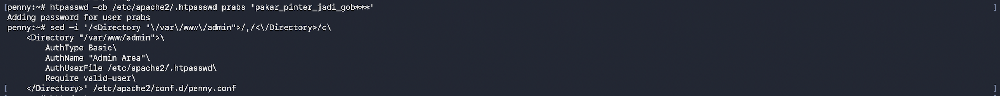
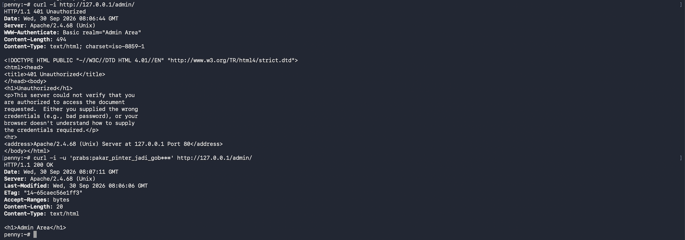

---

13. Setiap entitas dari luar harus memanggil gerbang dengan nama kanoniknya. Jika ada yang mencoba mengakses IP penny dan domain penny.xxx.com, paksa sistem melakukan redirect permanen (301) menuju www.xxx.com. Sebaliknya, jika ada yang mengakses IP abbey dan domain abbey.xxx.com, lakukan redirect sementara (302) menuju static.xxx.com.

Pada tahap ini diterapkan *redirect* kanonik: **penny** mengarahkan permanen (301) ke `www.iqbal.com`, sedangkan **abbey** mengarahkan sementara (302) ke `static.iqbal.com`.

#### **Konfigurasi Penny**

```apache
<VirtualHost *:80>
    ServerName 192.235.3.2
    ServerAlias penny.iqbal.com
    Redirect permanent / http://www.iqbal.com/
</VirtualHost>
```

#### **Konfigurasi Abbey**

```nginx
server {
    listen 80;
    server_name abbey.iqbal.com 192.235.2.2;
    return 302 http://static.iqbal.com$request_uri;
}
```

-----

#### **Validasi**

```bash
curl -I -H "Host: penny.iqbal.com" http://192.235.3.2/
curl -I -H "Host: abbey.iqbal.com" http://192.235.2.2/
```

Hasil yang telah diperoleh untuk Abbey:

```text
HTTP/1.1 302 Moved Temporarily
Location: http://static.iqbal.com/
```

**Hasil:**
Redirect Abbey berhasil diverifikasi dengan status `302` menuju `static.iqbal.com`. Penny dikonfigurasi dengan redirect permanen `301`.

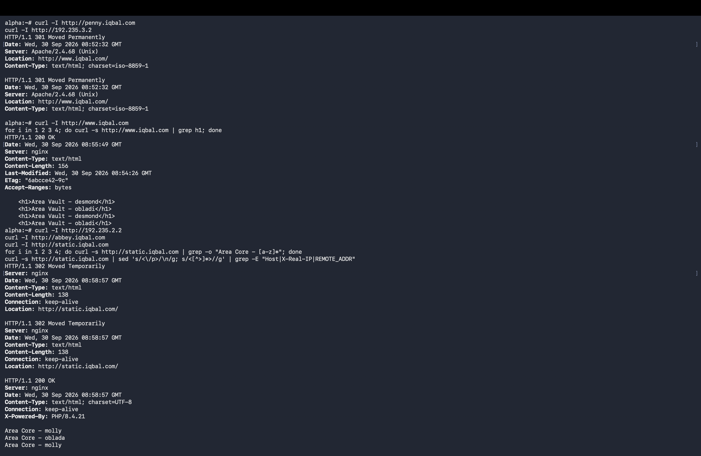

---

14. Di dalam The Mesh, rekam jejak tidak boleh dipalsukan oleh sistem. Pastikan access log pada setiap server web di area vault maupun area core mencatat alamat IP asli milik client yang diteruskan oleh gerbang, dan bukan mencatat IP dari Penny ataupun Abbey.

Pada tahap ini dipastikan *access log* pada backend mencatat alamat IP *client* yang sebenarnya, bukan alamat IP *reverse proxy* (Penny/Abbey).

#### **Konfigurasi Backend Vault (obladi, desmond — Apache)**

Menggunakan modul `remoteip` dengan header `X-Real-IP` yang diteruskan Penny, sehingga log mencatat `$remote_addr` dan `$http_x_real_ip` sesuai client asli.

#### **Konfigurasi Backend Core (oblada, molly — Nginx)**

```nginx
set_real_ip_from 192.235.2.2;   # IP abbey
real_ip_header X-Real-IP;
```

-----

#### **Validasi**

```sh
# dari alpha
curl http://www.iqbal.com/
curl http://static.iqbal.com/

# di obladi/desmond
tail -f /var/log/apache2/access.log

# di oblada/molly
tail -f /var/log/nginx/access.log
```

**Hasil yang Diharapkan:**
Log backend Vault menunjukkan `realip=192.235.4.2`, dan backend Core menunjukkan `REMOTE_ADDR: 192.235.4.2` — bukan IP Penny (`192.235.3.2`) atau Abbey (`192.235.2.2`).

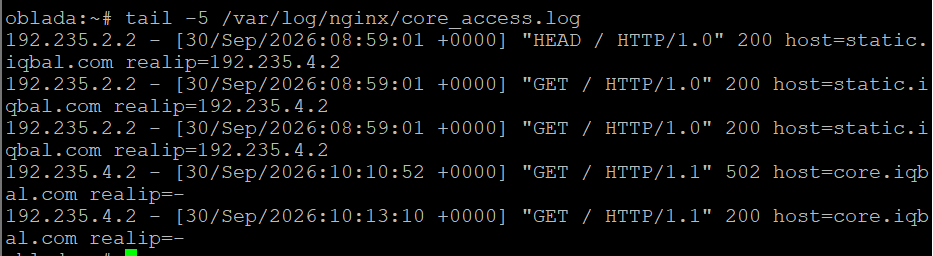

---

15. Rootkit menginstruksikan pembuatan jalur proxy khusus yang berdiri sendiri. Pada penny buat reverse proxy untuk path /eternal yang menyajikan directory /var/www/eternal, dan pastikan path ini dapat mengeksekusi (rendering) file php. Pada abbey, buat jalur /orion yang menyajikan directory /var/www/orion, secara murni statis tanpa perlu rendering php.

Pada tahap ini ditambahkan dua *path* khusus yang berdiri sendiri di luar proxy utama: **/eternal** di Penny (dinamis, bisa render PHP) dan **/orion** di Abbey (statis murni).

#### **Konfigurasi di Penny**

```apache
Alias /eternal /var/www/eternal
<Directory /var/www/eternal>
    AllowOverride All
    Require all granted
</Directory>
```

#### **Konfigurasi di Abbey**

```nginx
location /orion {
    alias /var/www/orion;
}
```

-----

#### **Validasi**

```sh
curl http://www.iqbal.com/eternal/
curl http://static.iqbal.com/orion/
```

**Hasil yang Diharapkan:**
Halaman Eternal menampilkan informasi dinamis (nama area, hostname, versi PHP). Halaman Orion menampilkan konten HTML statis tanpa diproses sebagai PHP.

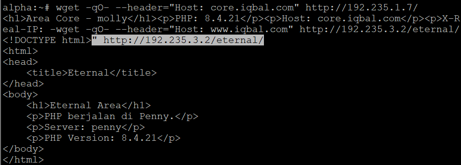

---

16. Ketahanan gerbang The Mesh harus diuji untuk menghadapi bombardir permintaan. Salah satu Klien (misal: Alpha) bertugas melakukan stress test benchmark menggunakan ApacheBench. Lakukan 250 requests dengan tingkat konkurensi 10 untuk masing-masing titik akhir: www.xxx.com dan static.xxx.com. Tampilkan rangkuman hasilnya.

Pengujian performa dilakukan dari node **alpha** menggunakan **ApacheBench (ab)**.

| Parameter      | Nilai                 |
| -------------- | ---------------------: |
| Jumlah request | 250                    |
| Concurrency    | 10                     |
| Endpoint       | `www.iqbal.com`        |
| Endpoint       | `static.iqbal.com`     |

#### **Pengujian www.iqbal.com**

```sh
ab -n 250 -c 10 -l -H "Host: www.iqbal.com" http://192.235.3.2/
```

**Hasil:**

```text
Complete requests:      250
Failed requests:        0
Requests per second:    1862.43 [#/sec]
Time per request:       5.369 ms
Total transferred:      95500 bytes
HTML transferred:       39250 bytes
```

#### **Pengujian static.iqbal.com**

```sh
ab -n 250 -c 10 -l -H "Host: static.iqbal.com" http://192.235.2.2/
```

**Hasil:**

```text
Complete requests:      250
Failed requests:        0
Requests per second:    1310.78 [#/sec]
Time per request:       7.629 ms
Total transferred:      72375 bytes
HTML transferred:       33375 bytes
```

| Parameter          | `www.iqbal.com` | `static.iqbal.com` |
| ------------------- | ---------------: | -------------------: |
| Requests/sec         |          1862.43 |               1310.78 |
| Time/request         |         5.369 ms |              7.629 ms |
| Failed               |                0 |                     0 |

-----

#### **Validasi**

**Hasil yang Diharapkan:**
`Failed requests: 0` pada kedua pengujian, membuktikan kedua gerbang (Penny dan Abbey) mampu menangani beban 250 request dengan konkurensi 10 tanpa kegagalan.

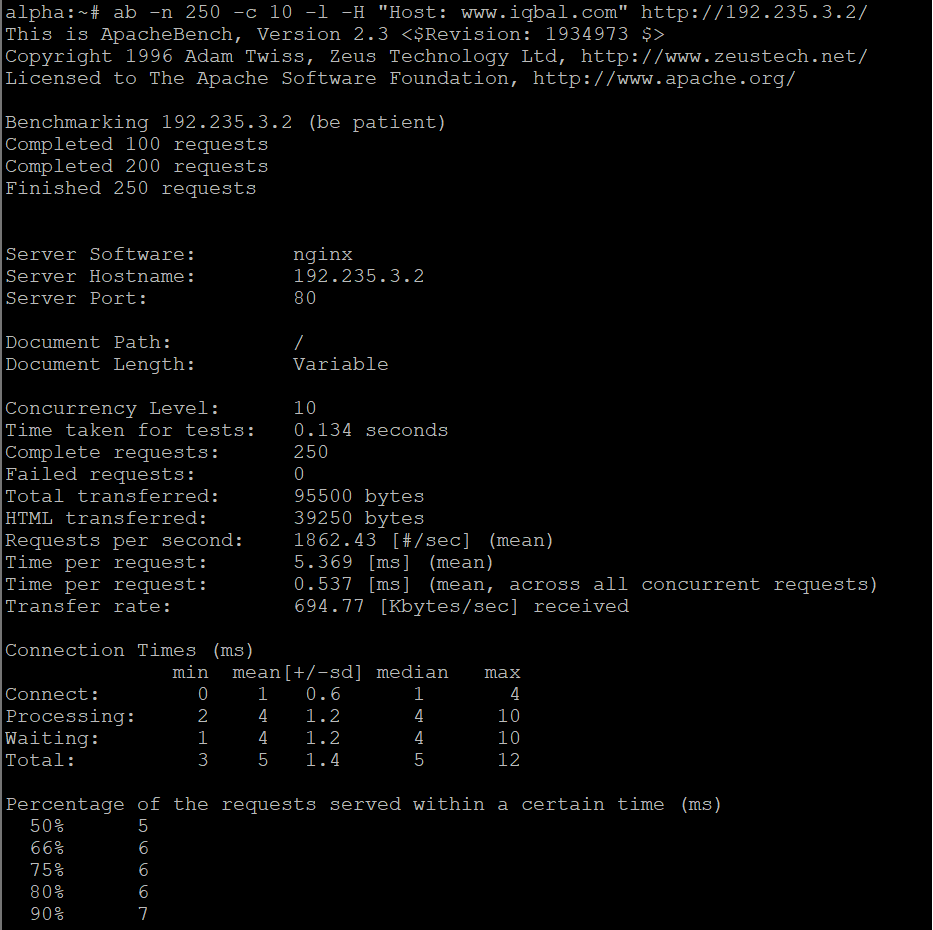

---

17. Tambahkan TXT record pada DNS untuk semua klien sayap kiri dan sayap kanan (Alpha, Beta, Gamma, Delta, Epsilon). Jika DNS di-query TXT terhadap nama domain mereka, sistem harus mengembalikan teks berupa nama hostname mereka masing-masing.

Pada tahap ini ditambahkan TXT record untuk kelima klien, dengan isi berupa nama *hostname* masing-masing.

#### **Konfigurasi pada Prab**

```dns
alpha       IN      TXT     "alpha"
beta        IN      TXT     "beta"
gamma       IN      TXT     "gamma"
delta       IN      TXT     "delta"
epsilon     IN      TXT     "epsilon"
```

Serial SOA dinaikkan dari `10` menjadi `11`.

```bash
named-checkconf /etc/bind/named.conf
named-checkzone iqbal.com /etc/bind/db.iqbal.com
```

-----

#### **Validasi**

```bash
dig @127.0.0.1 alpha.iqbal.com TXT +short
dig @127.0.0.1 beta.iqbal.com TXT +short
dig @127.0.0.1 gamma.iqbal.com TXT +short
dig @127.0.0.1 delta.iqbal.com TXT +short
dig @127.0.0.1 epsilon.iqbal.com TXT +short
```

**Hasil:**

```text
"alpha"
"beta"
"gamma"
"delta"
"epsilon"
```

TXT record berhasil ditambahkan dan dapat di-query melalui DNS master.


---

18. Ubah A record DNS milik abbey.xxxx.com ke alamat IP yang fiktif. Naikkan nilai serial SOA di prab dan pastikan tedd ikut tersinkron. Tetapkan TTL sebesar 15 detik pada record yang relevan. Verifikasi momen yang terjadi pada tiga fase pencarian: sebelum perubahan, saat perubahan baru terjadi dalam jeda TTL, dan setelah batas waktu TTL habis.

Pada tahap ini A record `abbey.iqbal.com` diubah sementara ke IP fiktif dengan TTL 15 detik, untuk menguji perilaku *caching* DNS sebelum dan sesudah perubahan.

#### **Konfigurasi**

IP awal: `192.235.2.2`
IP fiktif pengujian: `203.0.113.77`
TTL: `15` detik
Serial: `11` → `12`

**Master Prab:**

```dns
zone "iqbal.com" {
    type master;
    file "/etc/bind/db.iqbal.com";
    allow-transfer { 192.235.1.3; };
};
```

```dns
abbey   15  IN A 203.0.113.77
```

**Slave Tedd:**

```dns
zone "iqbal.com" {
    type slave;
    masters { 192.235.1.2; };
    file "/var/bind/db.iqbal.com";
};
```

-----

#### **Validasi**

**Sebelum perubahan:**

```bash
dig @127.0.0.1 abbey.iqbal.com A +noall +answer
```

Hasil:

```text
abbey.iqbal.com. 604800 IN A 192.235.2.2
```

**Setelah perubahan:**

```bash
dig @127.0.0.1 abbey.iqbal.com A +noall +answer
```

Hasil:

```text
abbey.iqbal.com. 15 IN A 203.0.113.77
```

**Validasi Slave:**
Zone transfer berhasil sehingga `tedd` menerima record baru dengan serial yang sama dengan prab.

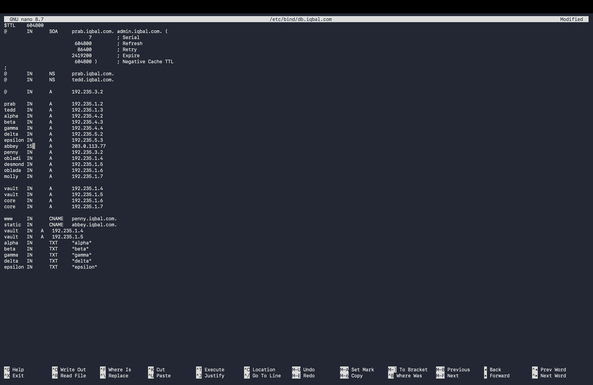

---

19. Last? But not least? Buat CNAME record yang melakukan binding dari domain internal outbound.xxxx.com menuju domain eksternal http.badssl.com. Lakukan perintah curl ke outbound.xxxx.com dan pastikan output yang dihasilkan sesuai dengan isi konten di halaman http.badssl.com.

Pada tahap ini dibuat CNAME `outbound.iqbal.com` yang mengarah ke domain eksternal `http.badssl.com`, lalu diuji dengan `curl`.

#### **Konfigurasi**

```dns
outbound    IN      CNAME   http.badssl.com.
```

Serial SOA dinaikkan dari `12` menjadi `13`.

-----

#### **Validasi DNS**

```bash
dig @127.0.0.1 outbound.iqbal.com CNAME +short
```

Hasil:

```text
http.badssl.com.
```

#### **Validasi HTTP**

```bash
curl -I http://outbound.iqbal.com
```

Hasil:

```text
HTTP/1.1 200 OK
Server: nginx/1.10.3 (Ubuntu)
```

**Hasil:**
CNAME berhasil mengarah ke `http.badssl.com` dan request HTTP memperoleh respons `200 OK`.

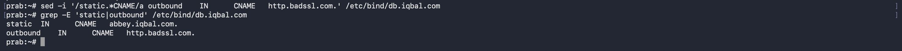
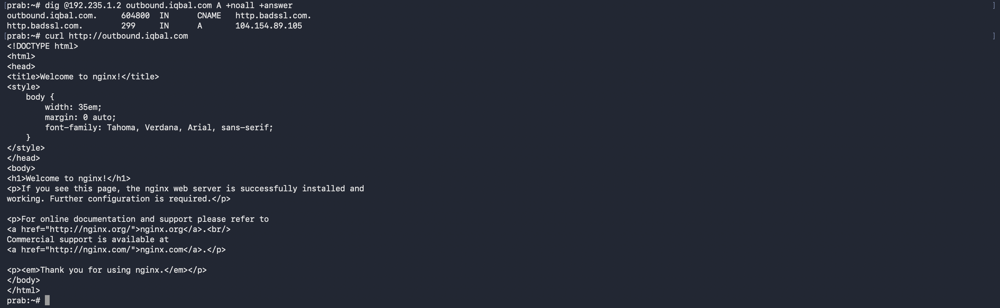

---

20. Setelah semua penyelesaian selesai, pastikan semua service dan konfigurasi yang telah dikerjakan dari awal tetap berjalan normal dan berstatus autostart saat node di-restart (khusus untuk kasus ini, abaikan konfigurasi nomor 18 dan biarkan koordinat kembali normal).

Pada tahap terakhir ini dipastikan seluruh *service* tetap berjalan otomatis saat *node* di-restart, dan konfigurasi sementara pada soal 18 dikembalikan ke keadaan normal.

#### **Mekanisme Autostart**

Pada environment yang digunakan, `/etc/alpinet-init.sh` menjalankan `/root/init.sh` jika file tersebut ada dan *executable*:

```sh
[ -f /root/init.sh ] && [ -x /root/init.sh ] && /root/init.sh
```

**Prab & Tedd:**

```sh
#!/bin/sh
named
```

**Penny, Obladi, Desmond:**

```sh
#!/bin/sh
httpd -k start
```

**Abbey:**

```sh
#!/bin/sh
nginx
```

**Oblada & Molly:**

```sh
#!/bin/sh
php-fpm84 -D
nginx
```

Permission:

```bash
chmod +x /root/init.sh
```

#### **Kondisi Final**

Sesuai instruksi soal nomor 20, konfigurasi sementara nomor 18 dikembalikan ke:

```text
abbey.iqbal.com -> 192.235.2.2
```

dengan TTL normal dan serial SOA dinaikkan kembali. Record nomor 19 tetap dipertahankan.

-----

#### **Validasi**

**DNS:**

```bash
ps | grep '[n]amed'
dig @127.0.0.1 iqbal.com SOA +short
```

**Apache:**

```bash
ss -lntp | grep ':80'
```

**Nginx dan PHP-FPM:**

```bash
ss -lntp | grep ':80'
ps | grep '[p]hp-fpm'
```

**Hasil:**
`/root/init.sh` telah dibuat pada node-node service dan diberikan permission executable sebagai mekanisme autostart ketika container/node dijalankan kembali.

---

# Kendala

1. Environment menggunakan Alpine Linux dalam container GNS3 sehingga service dijalankan langsung menggunakan binary service, bukan `systemd`/`service` konvensional.
2. Pada soal 18, `tedd` merupakan authoritative slave sehingga query langsung ke `tedd` tidak menunjukkan perilaku cache resolver seperti pada resolver caching biasa.
3. Terdapat warning Apache terkait modul yang telah termuat sebelumnya, tetapi service tetap dapat berjalan.
4. Pada Nginx perlu memperhatikan file `default.conf` agar tidak terjadi konflik `default_server`.

---

# Kesimpulan

Seluruh 20 poin pada praktikum The Mesh telah dikerjakan pada topologi dengan prefix IP `192.235.0.0/16`. `rootkit` berfungsi sebagai router utama dengan NAT dan routing antar lima subnet. DNS master `prab` dan slave `tedd` digunakan untuk resolusi domain `iqbal.com`, mencakup forward DNS, reverse DNS, TXT record, CNAME, serta mekanisme zone transfer.

Area vault (obladi, desmond) menggunakan Apache untuk layanan web statis dengan autoindex, sedangkan area core (oblada, molly) menggunakan Nginx dan PHP-FPM untuk layanan web dinamis dengan URL rewrite. `penny` dan `abbey` berfungsi sebagai reverse proxy dan load balancer menuju backend masing-masing, dilengkapi forwarding header `Host` dan `X-Real-IP` agar IP client asli tetap tercatat di log backend, serta perlindungan basic authentication pada `/admin` dan redirect kanonik (301/302).

Pengujian performa menggunakan ApacheBench menunjukkan kedua endpoint utama (`www.iqbal.com` dan `static.iqbal.com`) berhasil menangani 250 request dengan konkurensi 10 tanpa kegagalan.

Mekanisme `/root/init.sh` digunakan agar seluruh service dapat berjalan otomatis ketika node di-restart. Sebelum demo dan submission final, perubahan sementara pada nomor 18 dikembalikan ke IP normal `192.235.2.2` sesuai instruksi nomor 20.
