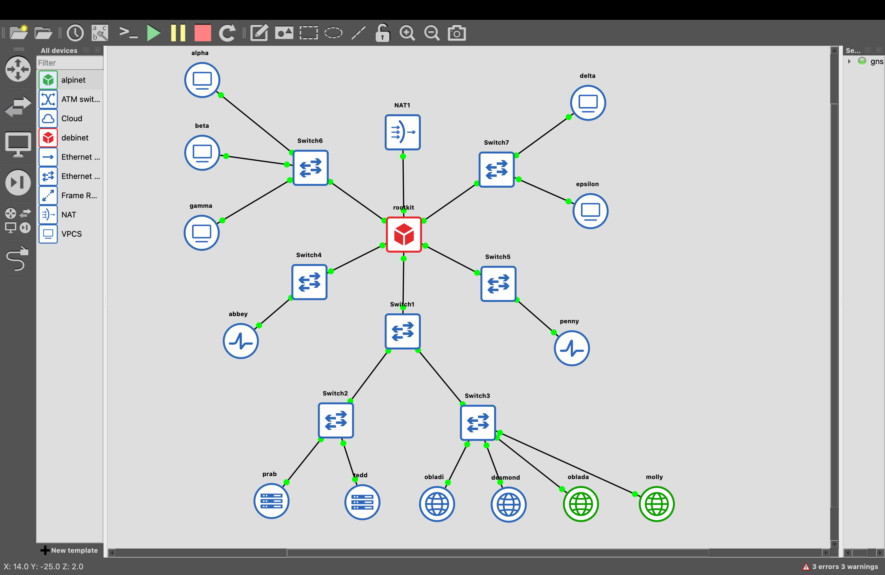
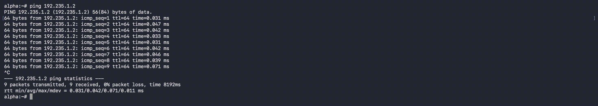
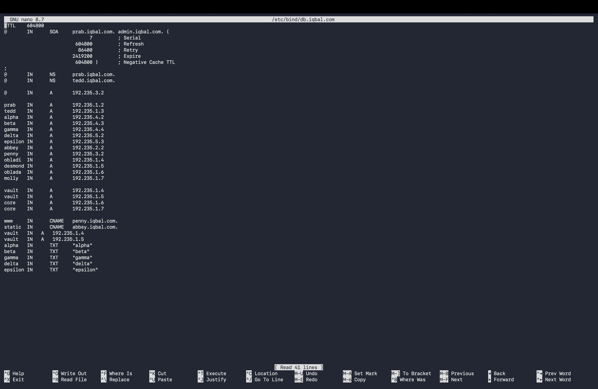

# PRAKTIKUM JARKOM MODUL 2 2026

## LAPORAN RESMI

### Anggota Kelompok

| Nama | NRP |
|---|---|
| Iqbal Rizki Muhammad Fadhli | 5027251027|
| [Nama Anggota 2] | [NRP] |

---

# Nomor 1

## Soal
Sebagai pusat kesadaran The Mesh, `rootkit` harus merentangkan koneksinya ke lima gerbang utama (Switch). Tetapkan alamat IP dan default gateway untuk seluruh Entitas sesuai prefix IP kelompok.

## Konfigurasi

| Node | IP Address | Gateway |
|---|---|---|
| rootkit eth1 | 192.235.1.1/24 | - |
| rootkit eth2 | 192.235.2.1/24 | - |
| rootkit eth3 | 192.235.3.1/24 | - |
| rootkit eth4 | 192.235.4.1/24 | - |
| rootkit eth5 | 192.235.5.1/24 | - |
| alpha | 192.235.4.2/24 | 192.235.4.1 |
| beta | 192.235.4.3/24 | 192.235.4.1 |
| gamma | 192.235.4.4/24 | 192.235.4.1 |
| delta | 192.235.5.2/24 | 192.235.5.1 |
| epsilon | 192.235.5.3/24 | 192.235.5.1 |
| prab | 192.235.1.2/24 | 192.235.1.1 |
| tedd | 192.235.1.3/24 | 192.235.1.1 |
| abbey | 192.235.2.2/24 | 192.235.2.1 |
| penny | 192.235.3.2/24 | 192.235.3.1 |
| obladi | 192.235.1.4/24 | 192.235.1.1 |
| desmond | 192.235.1.5/24 | 192.235.1.1 |
| oblada | 192.235.1.6/24 | 192.235.1.1 |
| molly | 192.235.1.7/24 | 192.235.1.1 |

### Konfigurasi Router

```bash
sysctl -w net.ipv4.ip_forward=1
ip addr add 192.235.1.1/24 dev eth1
ip addr add 192.235.2.1/24 dev eth2
ip addr add 192.235.3.1/24 dev eth3
ip addr add 192.235.4.1/24 dev eth4
ip addr add 192.235.5.1/24 dev eth5
```

### Validasi

```bash
ip addr
ip route
ping -c 3 192.235.1.1
ping -c 3 192.235.2.1
ping -c 3 192.235.3.1
```

### Hasil
Setiap node menggunakan alamat IP sesuai subnet dan `rootkit` sebagai default gateway.

### Dokumentasi 



---

# Nomor 9

## Soal
Jalankan layanan web statis pada area vault menggunakan Apache. Folder `/arsip/` harus mendukung autoindex/directory listing dan pengujian dilakukan melalui hostname.

## Konfigurasi

Backend:
- `obladi` — `192.235.1.4`
- `desmond` — `192.235.1.5`

```apache
<Directory "/var/www/vault/arsip">
    Options +Indexes
    AllowOverride None
    Require all granted
</Directory>
```

### Validasi

```bash
httpd -t
ss -lntp | grep ':80'
curl -I -H "Host: vault.iqbal.com" http://192.235.1.4/
curl -I -H "Host: vault.iqbal.com" http://192.235.1.5/
curl -H "Host: vault.iqbal.com" http://192.235.1.4/arsip/
```

### Hasil
Apache berjalan pada backend vault dan `/arsip/` dikonfigurasi untuk directory listing melalui `vault.iqbal.com`.

---

# Nomor 10

## Soal
Jalankan layanan web dinamis PHP-FPM menggunakan Nginx pada area core. Sediakan halaman beranda dan `/profil` dengan URL bersih.

## Konfigurasi

Backend:
- `oblada` — `192.235.1.6`
- `molly` — `192.235.1.7`

```nginx
server {
    listen 80;
    server_name core.iqbal.com;

    root /var/www/core;
    index index.php;

    location / {
        try_files $uri $uri/ $uri.php?$query_string;
    }

    location /profil {
        try_files $uri $uri.php =404;
    }

    location ~ \.php$ {
        include fastcgi_params;
        fastcgi_param SCRIPT_FILENAME $document_root$fastcgi_script_name;
        fastcgi_pass 127.0.0.1:9000;
    }
}
```

### Validasi

```bash
nginx -t
ss -lntp | grep ':80'
ps | grep '[p]hp-fpm'
curl -I -H "Host: core.iqbal.com" http://127.0.0.1/
curl -H "Host: core.iqbal.com" http://127.0.0.1/profil
```

### Hasil
Nginx dan PHP-FPM berhasil berjalan pada `oblada` dan `molly`. Pengujian sebelumnya menghasilkan `HTTP/1.1 200 OK` dan `X-Powered-By: PHP/8.4.21`.

---

# Nomor 11

## Soal
`penny` menggunakan Apache sebagai reverse proxy menuju `obladi` dan `desmond`, sedangkan `abbey` menggunakan Nginx menuju `oblada` dan `molly`. Header `Host` dan `X-Real-IP` harus diteruskan.

## Konfigurasi Penny

```apache
<Proxy "balancer://vault">
    BalancerMember "http://192.235.1.4"
    BalancerMember "http://192.235.1.5"
    ProxySet lbmethod=byrequests
</Proxy>

ProxyPass "/" "balancer://vault/"
ProxyPassReverse "/" "balancer://vault/"
ProxyPreserveHost On
RequestHeader set X-Real-IP "%{REMOTE_ADDR}s"
```

## Konfigurasi Abbey

```nginx
upstream core_backend {
    server 192.235.1.6;
    server 192.235.1.7;
}

server {
    listen 80;
    server_name core.iqbal.com;

    location / {
        proxy_pass http://core_backend;
        proxy_set_header Host $host;
        proxy_set_header X-Real-IP $remote_addr;
        proxy_set_header X-Forwarded-For $proxy_add_x_forwarded_for;
    }
}
```

### Validasi

```bash
httpd -t
nginx -t
curl -H "Host: www.iqbal.com" http://192.235.3.2/
curl -H "Host: core.iqbal.com" http://192.235.2.2/
```

### Hasil
`penny` dikonfigurasi sebagai reverse proxy area vault dan `abbey` sebagai reverse proxy area core dengan forwarding `Host` dan `X-Real-IP`.

---

# Nomor 12

## Soal
Lindungi path `/admin` pada `penny` menggunakan Basic Authentication.

## Konfigurasi

```text
Username : prabs
Password : pakar_pinter_jadi_gob***
```

```bash
htpasswd -bc /etc/apache2/.htpasswd prabs 'pakar_pinter_jadi_gob***'
```

```apache
<Location "/admin">
    AuthType Basic
    AuthName "Restricted Area"
    AuthUserFile "/etc/apache2/.htpasswd"
    Require valid-user
</Location>
```

### Validasi

Tanpa credential:

```bash
curl -I http://192.235.3.2/admin
```

Dengan credential:

```bash
curl -u 'prabs:pakar_pinter_jadi_gob***' -H "Host: www.iqbal.com" http://192.235.3.2/admin
```

### Hasil
Akses tanpa credential ditolak, sedangkan credential `prabs` dengan password yang ditentukan digunakan untuk mengakses `/admin`.

---

# Nomor 13

## Soal
Akses ke IP/domain `penny` diarahkan permanen dengan status 301 ke `www.iqbal.com`. Akses ke IP/domain `abbey` diarahkan sementara dengan status 302 ke `static.iqbal.com`.

## Konfigurasi Penny

```apache
<VirtualHost *:80>
    ServerName 192.235.3.2
    ServerAlias penny.iqbal.com
    Redirect permanent / http://www.iqbal.com/
</VirtualHost>
```

## Konfigurasi Abbey

```nginx
server {
    listen 80;
    server_name abbey.iqbal.com 192.235.2.2;
    return 302 http://static.iqbal.com$request_uri;
}
```

### Validasi

```bash
curl -I -H "Host: penny.iqbal.com" http://192.235.3.2/
curl -I -H "Host: abbey.iqbal.com" http://192.235.2.2/
```

Hasil yang telah diperoleh untuk Abbey:

```text
HTTP/1.1 302 Moved Temporarily
Location: http://static.iqbal.com/
```

### Hasil
Redirect Abbey berhasil diverifikasi dengan status `302` menuju `static.iqbal.com`. Penny dikonfigurasi dengan redirect permanen `301`.

---

# Nomor 17

## Soal
Tambahkan TXT record untuk Alpha, Beta, Gamma, Delta, dan Epsilon. Query TXT harus mengembalikan nama hostname masing-masing.

## Konfigurasi pada Prab

```dns
alpha       IN      TXT     "alpha"
beta        IN      TXT     "beta"
gamma       IN      TXT     "gamma"
delta       IN      TXT     "delta"
epsilon     IN      TXT     "epsilon"
```

Serial SOA dinaikkan dari `10` menjadi `11`.

```bash
named-checkconf /etc/bind/named.conf
named-checkzone iqbal.com /etc/bind/db.iqbal.com
```

### Validasi

```bash
dig @127.0.0.1 alpha.iqbal.com TXT +short
dig @127.0.0.1 beta.iqbal.com TXT +short
dig @127.0.0.1 gamma.iqbal.com TXT +short
dig @127.0.0.1 delta.iqbal.com TXT +short
dig @127.0.0.1 epsilon.iqbal.com TXT +short
```

### Hasil

```text
"alpha"
"beta"
"gamma"
"delta"
"epsilon"
```

### Dokumentasi


TXT record berhasil ditambahkan dan dapat di-query melalui DNS master.

---

# Nomor 18

## Soal
Ubah A record `abbey.iqbal.com` menjadi IP fiktif yang valid, naikkan serial SOA, sinkronkan ke `tedd`, dan gunakan TTL 15 detik.

## Konfigurasi

IP awal:

```text
192.235.2.2
```

IP fiktif pengujian:

```text
203.0.113.77
```

TTL:

```text
15
```

Serial:

```text
11 -> 12
```

### Master Prab

```dns
zone "iqbal.com" {
    type master;
    file "/etc/bind/db.iqbal.com";
    allow-transfer { 192.235.1.3; };
};
```

### Slave Tedd

```dns
zone "iqbal.com" {
    type slave;
    masters { 192.235.1.2; };
    file "/var/bind/db.iqbal.com";
};
```

### Validasi Sebelum Perubahan

```bash
dig @127.0.0.1 abbey.iqbal.com A +noall +answer
```

Hasil:

```text
abbey.iqbal.com. 604800 IN A 192.235.2.2
```

### Validasi Setelah Perubahan

```bash
dig @127.0.0.1 abbey.iqbal.com A +noall +answer
```

Hasil:

```text
abbey.iqbal.com. 15 IN A 203.0.113.77
```

### Validasi Slave

Zone transfer berhasil sehingga `tedd` menerima record baru dan serial yang sama.

### Catatan

Query langsung ke `tedd` tidak membuktikan fase cache 15 detik karena `tedd` merupakan authoritative slave, bukan resolver caching. Fase cache seharusnya diuji melalui resolver caching yang melakukan query sebelum perubahan.

---

# Nomor 19

## Soal
Buat CNAME `outbound.iqbal.com` menuju `http.badssl.com`, kemudian lakukan `curl` ke `http://outbound.iqbal.com`.

## Konfigurasi

```dns
outbound    IN      CNAME   http.badssl.com.
```

Serial SOA dinaikkan dari `12` menjadi `13`.

### Validasi DNS

```bash
dig @127.0.0.1 outbound.iqbal.com CNAME +short
```

Hasil:

```text
http.badssl.com.
```

### Validasi HTTP

```bash
curl -I http://outbound.iqbal.com
```

Hasil pengujian:

```text
HTTP/1.1 200 OK
Server: nginx/1.10.3 (Ubuntu)
```

### Hasil
CNAME berhasil mengarah ke `http.badssl.com` dan request HTTP memperoleh respons `200 OK`.

---

# Nomor 20

## Soal
Pastikan seluruh service dan konfigurasi tetap berjalan normal dan autostart ketika node di-restart. Konfigurasi nomor 18 diabaikan dan koordinat dikembalikan normal.

## Mekanisme Autostart

Pada environment yang digunakan, `/etc/alpinet-init.sh` menjalankan `/root/init.sh` jika file tersebut ada dan executable:

```sh
[ -f /root/init.sh ] && [ -x /root/init.sh ] && /root/init.sh
```

## Prab

```sh
#!/bin/sh
named
```

## Tedd

```sh
#!/bin/sh
named
```

## Penny

```sh
#!/bin/sh
httpd -k start
```

## Abbey

```sh
#!/bin/sh
nginx
```

## Obladi

```sh
#!/bin/sh
httpd -k start
```

## Desmond

```sh
#!/bin/sh
httpd -k start
```

## Oblada

```sh
#!/bin/sh
php-fpm84 -D
nginx
```

## Molly

```sh
#!/bin/sh
php-fpm84 -D
nginx
```

Permission:

```bash
chmod +x /root/init.sh
```

### Validasi

DNS:

```bash
ps | grep '[n]amed'
dig @127.0.0.1 iqbal.com SOA +short
```

Apache:

```bash
ss -lntp | grep ':80'
```

Nginx dan PHP-FPM:

```bash
ss -lntp | grep ':80'
ps | grep '[p]hp-fpm'
```

### Hasil

`/root/init.sh` telah dibuat pada node-node service dan diberikan permission executable untuk digunakan sebagai mekanisme autostart ketika container/node dijalankan kembali.

### Kondisi Final

Sesuai instruksi soal nomor 20, konfigurasi sementara nomor 18 harus dikembalikan ke:

```text
abbey.iqbal.com -> 192.235.2.2
```

dengan TTL normal dan serial SOA dinaikkan kembali. Record nomor 19 tetap dipertahankan.

---

# Kendala

1. Environment menggunakan Alpine Linux dalam container GNS3 sehingga service dijalankan langsung menggunakan binary service.
2. Pada soal 18, `tedd` merupakan authoritative slave sehingga query langsung ke `tedd` tidak menunjukkan cache resolver.
3. Terdapat warning Apache terkait modul yang telah termuat sebelumnya, tetapi service tetap dapat berjalan.
4. Pada Nginx perlu memperhatikan file `default.conf` agar tidak terjadi konflik `default_server`.

---

# Kesimpulan

Konfigurasi nomor 1, 9, 10, 11, 12, 13, 17, 18, 19, dan 20 telah dikerjakan pada topologi The Mesh. `rootkit` berfungsi sebagai router utama, area vault menggunakan Apache, area core menggunakan Nginx dan PHP-FPM, serta `penny` dan `abbey` berfungsi sebagai reverse proxy.

DNS master `prab` dan slave `tedd` digunakan untuk resolusi domain, TXT record, CNAME, dan zone transfer. Mekanisme `/root/init.sh` digunakan untuk mempertahankan service agar dapat dijalankan kembali ketika node direstart.

Sebelum demo dan submission final, perubahan sementara pada nomor 18 perlu dikembalikan ke IP normal `192.235.2.2` sesuai instruksi nomor 20.

